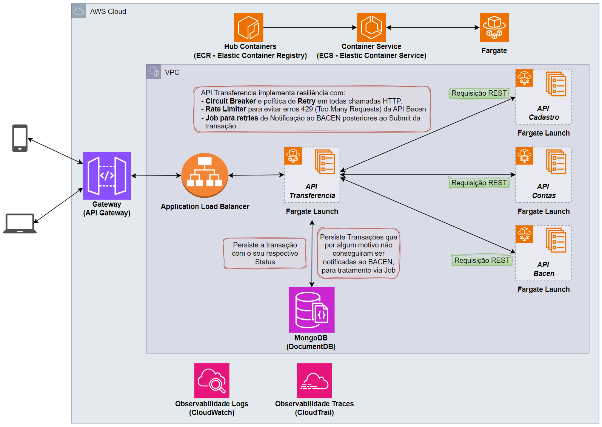
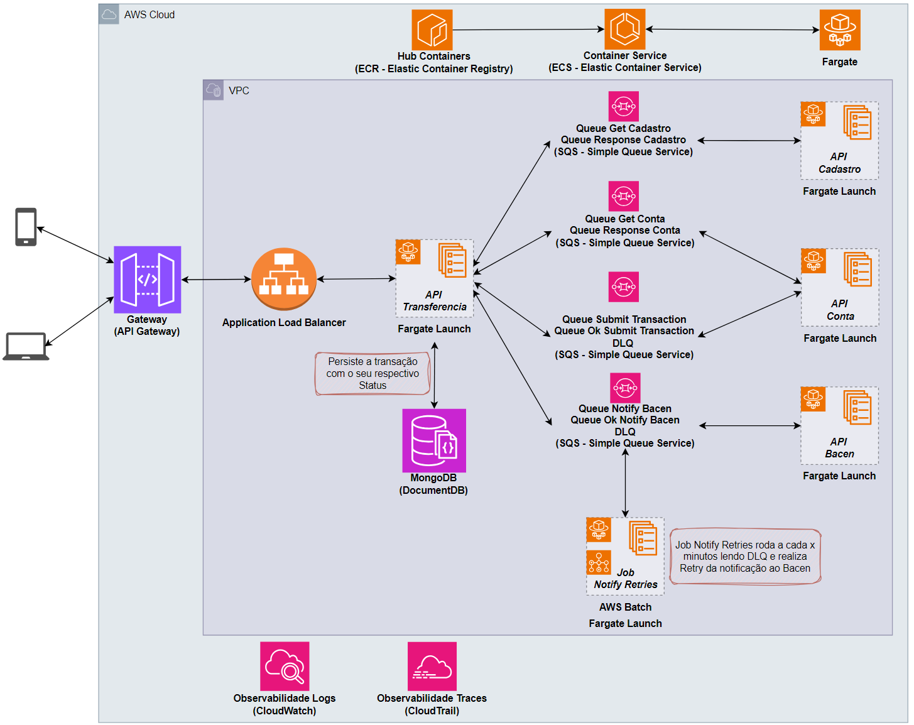

<div align="center">

# Desafio Engenharia de Software - Itaú


<br><br>


</div>

<div align="center">

# Bank Transfer - Itaú
O objetivo do desafio é desenhar e desenvolver uma solução que permita que os clientes do Itaú consigam realizar Transferência entre contas.
<br>Essa solução precisa ser resiliente, ter alta disponibilidade e de fácil evolução/manutenção.

## 💻 Sobre o projeto

Serviço responsável por realizar transferências bancárias validando informações na "API Cadastro" e "API Contas" e por
fim, notificar o Bacen por meio da "API Bacen"

</div>

## 💫 Arquitetura da solução
- A arquitetura da solução foi baseada em serviços AWS com containers provisionados no ECS com launch Fargate.


<br>

## 🚀 Como executar o projeto

### Pré-requisitos

Antes de começar, você vai precisar ter instalado em sua máquina as seguintes ferramentas:
[Java](https://www.oracle.com/java/technologies/javase/jdk17-archive-downloads.html), [Maven](https://maven.apache.org/download.cgi) e [Docker](https://www.docker.com/products/docker-desktop/)

#### 🎲 Rodando o Microserviço
```bash
# Clone este repositório
$ git clone https://github.com/sartori00/bank-transfer.git

# Acesse a pasta do projeto no terminal/cmd
$ cd bank-transfer

#Certifique de que o Docker está em execução

Execute a aplicação na sua IDE por meio da classe BankTransferApplication.

# A aplicação será inicializada na porta: 8080 
```

##### Ao executar a aplicação no profile "dev" será criado também:
- Um container no Docker com o MongoDB na porta 27017.
- Um container no Docker com uma instância de Wiremock com mocks dos microserviços que iremos nos utilizar.


## 📄 Documentação da API (Swagger)

A documentação da aplicação está disponível em: 

```bash
localhost:8080/swagger-ui/index.html
```

## 🛠 Tecnologias

- Java 21
- Maven
- Lombok
- Spring Boot 3.2.4
- Spring OpenFeign
- Spring Boot Docker Compose (apenas no profile dev)
- Spring Validation
- Spring Doc (Swagger) 2.5.0
- Tomcat (Integrado ao Spring Boot)
- MongoDB
- Resilience4j

## 💡 Highlights do Desafio

<span style="color:orange"><strong>1</strong></span><span style="color:#f0c665"> - Utilização de Docker Compose integrado 
ao Start da aplicação para disponibilizar instâncias de MongoDB e Wiremock 
(Em ambiente de desenvolvimento).</span>

<span style="color:orange"><strong>2</strong></span><span style="color:#f0c665"> - O Desenho da solução foi pensado 
utilizando serviços da AWS.</span>

<span style="color:orange"><strong>3</strong></span><span style="color:#f0c665"> - Design Patterns Implementados:</span> 
>- **Facade**: Utilizado na classe TransferProcessService para simplificar o processo da transação.
>- **Strategy**: Utilizado para validações de regra de negócio.
>- **Observer**: Utilizado ApplicationEventPublisher para desacoplamento dos componentes, permitindo que observadores reajam 
conforme necessário, permitindo facil manutenção / evolução.
>- **Proxy**: Utilizado Spring OpenFeign para abstrair chamadas a serviços REST externos, fornecendo clientes HTTP declarativos 
para fácil utilização e manutenção.
>- **Interceptor**: Utilizado ControllerAdvice para interceptar exceptions e transforma-las em responses amigáveis para 
o consumidor da API.
>- **Builder**: Utilizado para facilitar instanciação de objetos, tornando mais legível.
>- **State**: Utilizado Circuit Breaker do Resilience4J para reduzir requisições com timeout, permitindo "falhar rápido" ou 
obter soluções alternativas quando algum serviço externo a nossa aplicação está indisponível.

<span style="color:orange"><strong>4</strong></span><span style="color:#f0c665"> - Documentação personalizada para as 
necessidades da aplicação.</span>

<span style="color:orange"><strong>5</strong></span><span style="color:#f0c665"> - Propostas de melhoria na arquitetura 
da solução:</span>

>- Minha proposta de melhoria para a arquitetura é o desacoplamento dos serviços, eliminando requisições REST
e implementando filas de mensagens com SQS, desta forma teremos comunicação assíncrona entre os serviços, melhor 
gerenciamento de escalabilidade e suporte a DLQs para tratamento de mensagens que algum erro aconteceu.
>- No meu projeto, implementei uma solução de resiliência que garante a notificação ao BACEN após o submit de 
uma transação, pois caso houver alguma indisponibilidade na API Bacen, e não conseguirmos recuperar com o retry,
a transação é persistida em uma collection do MongoDB e tratada por um JOB que roda a cada X minutos varrendo essa 
collection e realizando retries após uma possível recuperação do serviço API Bacen, com este novo modelo baseado em 
filas, podemos ter uma DLQ da fila de notificação do BACEN e apartar do projeto API transferencia este Job e assim 
gerencia-lo por meio do AWS Batch em conjunto com Fargate realizando estes retries de forma independente desacoplando
mais uma solução.


<br>

<span style="color:orange"><strong>6</strong></span><span style="color:#f0c665"> - Padrões de Resiliência implementados 
na aplicação:</span>
>- Circuit Breaker
>- Retry
>- Rate Limiter

<span style="color:orange"><strong>7</strong></span><span style="color:#f0c665"> - +50 testes unitários automatizados 
cobrindo mais de 90% dos métodos.</span>

<span style="color:orange"><strong>8</strong></span><span style="color:#f0c665"> - ControllerAdvice implementado para 
melhor legibilidade e organização, diminuindo drasticamente a complexidade do código.</span>

<span style="color:orange"><strong>9</strong></span><span style="color:#f0c665"> - Utilização do Design Pattern Observer 
implementado por ApplicationEventPublisher para desacoplamento de componentes, permitindo facil manutenção / evolução.</span>

<span style="color:orange"><strong>10</strong></span><span style="color:#f0c665"> - Utilizado os princípios KISS, YAGNI, 
DRY e SOLID.</span>

<span style="color:orange"><strong>11</strong></span><span style="color:#f0c665"> - Utilização de Conventional Commits 
como padrão para os commits.</span>

# ⚙️ O Desafio:

## 1 - Desafio engenharia de software:

> Desenvolva uma API REST com os seguintes requisitos:
> 1. Ser desenvolvida em linguagem Java/Spring Boot;
> 2. Validar se o cliente que vai receber a transferência existe passando o idCliente na API de Cadastro;
> 3. Buscar dados da conta origem passando idConta na API de Contas;
> 4. Validar se a conta corrente está ativa;
> 5. Validar se o cliente tem saldo disponível na conta corrente para realizar a transferência;
> 6. A API de contas retornará o limite diário do cliente, caso o valor seja zero ou menor do que o valor da 
transferência a ser realizada, a transferência não poderá ser realizada;
> 7. Após a transferência é necessário notificar o BACEN de forma síncrona que a transação foi concluída com sucesso. 
A API do BACEN tem controle de rate limit e pode retornar 429 em caso de chamadas que excedam o limite;
> 8. Impedir que falhas momentâneas das dependências da aplicação impactem a experiência do cliente;

## 2 - Desafio arquitetura de solução:
> Crie um desenho de solução preferencialmente AWS para a API que foi desenvolvida no desafio de engenharia de software 
considerando os requisitos abaixo:
> 1. Apresentar uma proposta de escalonamento para casos de oscilação de carga;
> 2. Apresentar uma proposta de observabilidade;
> 3. Caso utilizado, justificar o uso de caching;
> 4. A solução precisa minimizar o impacto em caso de falhas das dependências (API Cadastro, Conta e BACEN).

## Pontos importantes:
> 1. Cuidado com padrão de projeto/arquitetura que traz complexidade prematura a solução. Foque nos princípios do KISS, 
YAGNI, DRY e SOLID.
> 2. Os desafios de engenharia de software e arquitetura serão realizados de forma assíncrona, ou seja, 
a pessoa poderá desenvolver sem supervisão.
> 3. Após a conclusão do desenvolvimento, o código e o desenho da arquitetura da solução devem ser disponibilizados 
no github pessoal.
> 4. O prazo para a entrega é de 10 dias
> 5. Fique à vontade para perguntar qualquer dúvida aos recrutadores.
> 6. Não é necessário desenvolver as APIs de cadastro, contas e BACEN. Os mocks dessas APIs estão no github 
https://github.com/mllcarvalho/DesafioItau